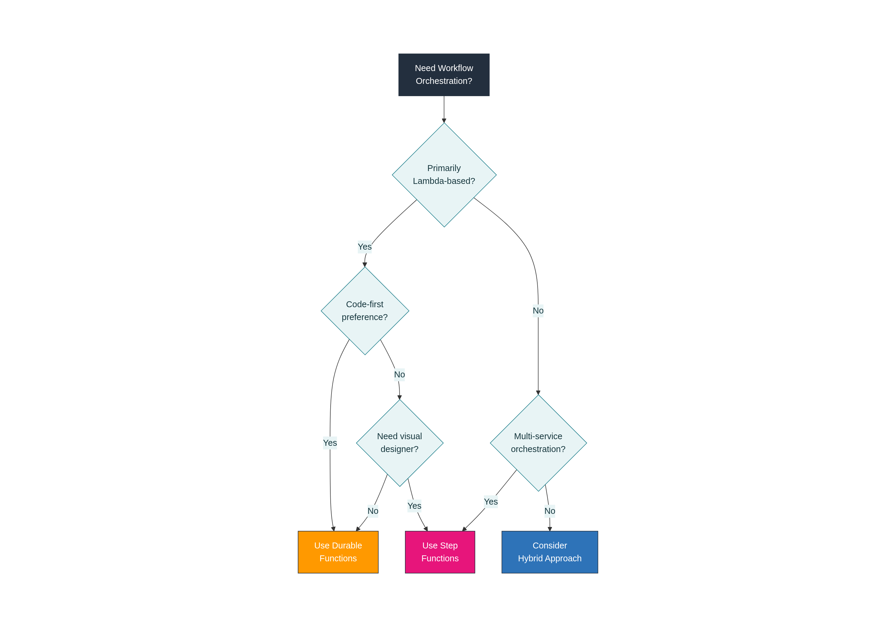
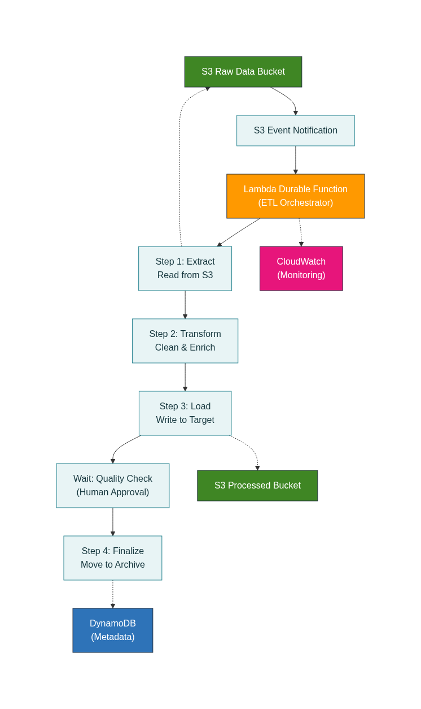

# AWS Lambda Durable Functions vs Step Functions: Cost Comparison

A real-world comparison of AWS Lambda Durable Functions and AWS Step Functions for ETL pipelines with human-in-the-loop approval workflows.

## 📊 Key Findings

| Metric | Durable Functions | Step Functions | Difference |
|--------|------------------|----------------|------------|
| **Total Cost (1,000 workflows)** | $0.044 | $0.207 | **79% cheaper** |
| **Cost per Workflow** | $0.000044 | $0.000207 | **79% cheaper** |
| **Lambda Invocations** | 1,788 | 5,000 | 64% fewer |
| **State Transitions** | 0 | 7,000 | N/A |
| **Success Rate** | 100% | 100% | Tie |
| **Zero-Cost Waiting** | ✅ Yes | ✅ Yes | Both |

**Bottom Line:** Durable Functions is 79% cheaper for this workload, primarily due to zero state transition costs.

## 🎯 What This Repository Contains

This repository contains a complete implementation comparing AWS Lambda Durable Functions against AWS Step Functions for ETL pipelines with human-in-the-loop approval workflows.

### Implementations

- **Durable Functions**: Single Lambda function with durable execution (`durable-functions/`)
- **Step Functions**: State machine with multiple Lambda functions (`step-functions/`)
- **Shared Resources**: Common approval API and DynamoDB tables (`shared-resources/`)
- **Scripts**: Deployment, testing, and cleanup utilities (`scripts/`)

## 🚀 Quick Start

### Prerequisites

- AWS Account
- AWS CLI configured
- AWS SAM CLI installed
- Python 3.14 or later
- Docker (for local testing)

### Deploy Shared Resources

```bash
cd shared-resources
sam build
sam deploy --guided
```

### Deploy Durable Functions

```bash
cd durable-functions
sam build
sam deploy --guided
```

### Deploy Step Functions

```bash
cd step-functions
sam build
sam deploy --guided
```

### Generate Test Data

```bash
python scripts/generate_test_data.py --count 1000 --output test-data/
```

### Upload Test Files

```bash
# For Durable Functions
aws s3 cp test-data/ s3://etl-raw-data-bucket-YOUR_AWS_ACCOUNT_ID/uploads/ --recursive

# For Step Functions  
./scripts/trigger_stepfunctions.sh
```

### Approve Workflows

```bash
./scripts/approve_all_jobs.sh
```

### Collect Metrics

```bash
python scripts/collect_blog_metrics.py
```

## 📁 Repository Structure

```
.
├── durable-functions/          # Lambda Durable Functions implementation
│   ├── src/
│   │   ├── handlers/          # Main Lambda handler
│   │   └── steps/             # ETL step functions
│   ├── template.yaml          # SAM template
│   └── tests/                 # Unit tests
│
├── step-functions/            # Step Functions implementation
│   ├── src/
│   │   └── steps/            # Individual Lambda functions
│   ├── statemachine/         # State machine definition
│   └── template.yaml         # SAM template
│
├── shared-resources/          # Shared infrastructure
│   ├── src/                  # Approval handler
│   └── template.yaml         # SAM template
│
├── scripts/                   # Utility scripts
│   ├── generate_test_data.py
│   ├── approve_all_jobs.sh
│   ├── collect_blog_metrics.py
│   └── cleanup_all_resources.sh
│
├── docs/                      # Documentation and diagrams
│   ├── architecture_diagram.png
│   └── decision_framework.png
│
└── README.md                  # This file
```

## 💡 Use Cases

This comparison is relevant for:

- **Document processing pipelines** with human review
- **ETL workflows** requiring approval steps
- **Compliance workflows** with manual validation
- **Data quality checks** with human-in-the-loop
- **Any serverless workflow** with long wait times

## 🔍 Key Insights

### Why Durable Functions is Cheaper

1. **No state transition costs** ($0 vs $0.175 for Step Functions)
2. **Fewer Lambda invocations** (1.788 vs 5 per workflow)
3. **Zero-cost waiting** during approval periods

### When to Use Durable Functions

✅ Cost optimization is critical  
✅ High volume (>10K workflows/month)  
✅ Simple linear workflows  
✅ Team prefers code-first approach  

### When to Use Step Functions

✅ Need visual workflow designer  
✅ Complex branching logic  
✅ High throughput (>1K concurrent)  
✅ Extensive AWS service integrations  
✅ Operational visibility is priority  

## 🎯 Decision Framework



Use this framework to choose the right solution for your use case based on cost sensitivity, workflow complexity, and operational requirements.  

## 🛠️ Architecture



### Durable Functions Architecture

```
S3 Upload → Lambda Durable Function
              ├─ Extract Data
              ├─ Transform Data
              ├─ Load Data
              ├─ Submit Approval (pause)
              │   ↓
              │   [Wait - zero cost]
              │   ↓
              └─ Finalize (resume)
```

### Step Functions Architecture

```
S3 Upload → Step Functions State Machine
              ├─ Extract Lambda
              ├─ Transform Lambda
              ├─ Load Lambda
              ├─ Approval Lambda (waitForTaskToken)
              │   ↓
              │   [Wait - zero cost]
              │   ↓
              └─ Finalize Lambda
```

## 📊 Experiment Methodology

- **Volume**: 1,000 documents per system
- **Workflow**: Extract → Transform → Load → Approval → Finalize
- **Approval wait**: Average 20 minutes
- **Measurement**: 24-hour window
- **Data source**: AWS CloudWatch metrics
- **Cost calculation**: Actual AWS pricing

## 🧪 Testing

### Run Unit Tests

```bash
# Durable Functions
cd durable-functions
python -m pytest tests/

# Step Functions
cd step-functions
python -m pytest tests/
```

### Local Testing

```bash
# Durable Functions
cd durable-functions
sam local invoke -e tests/fixtures/s3_event.json

# Step Functions
cd step-functions
sam local start-api
```

## 🧹 Cleanup

To delete all resources:

```bash
./scripts/delete_all_stacks.sh
```

Or manually:

```bash
sam delete --stack-name etl-durable
sam delete --stack-name etl-stepfn
sam delete --stack-name etl-shared-resources
```

## 📝 Cost Breakdown

### Durable Functions ($0.044 per 1,000 workflows)

- Lambda Invocations: $0.000358
- Lambda Duration: $0.0308
- State Transitions: $0
- DynamoDB: $0.003
- S3 Operations: $0.010

### Step Functions ($0.207 per 1,000 workflows)

- Lambda Invocations: $0.001
- Lambda Duration: $0.0179
- State Transitions: $0.175 (84% of total)
- DynamoDB: $0.003
- S3 Operations: $0.010

## 🤝 Contributing

Contributions are welcome! Please:

1. Fork the repository
2. Create a feature branch
3. Make your changes
4. Add tests if applicable
5. Submit a pull request

## 📄 License

MIT License - see LICENSE file for details
