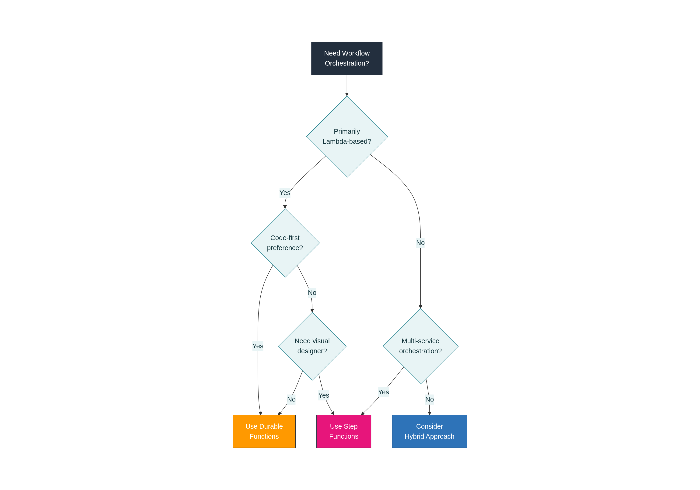
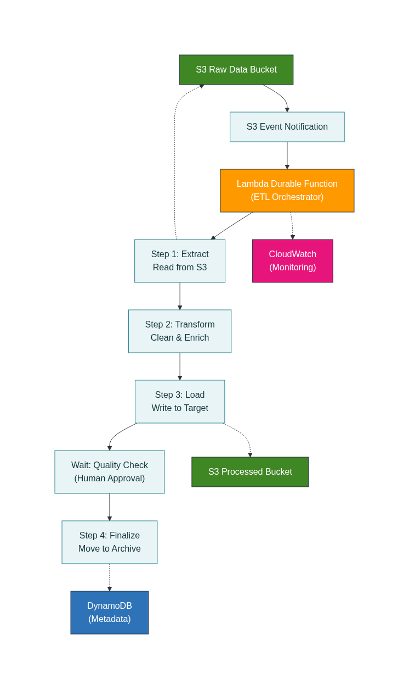

# AWS Lambda Durable Functions vs Step Functions: Cost Comparison

A real-world comparison of AWS Lambda Durable Functions and AWS Step Functions for ETL pipelines with human-in-the-loop approval workflows.

## 📊 Key Findings

Measured on real AWS (us-east-1), **60 runs** (2 arms × 3 volumes × 10 repetitions),
per-workflow cost as **mean ± 95% CI**. Full methodology and evidence: [`harness/REPORT.md`](harness/REPORT.md).

| Metric | Durable Functions | Step Functions Standard | Difference |
|--------|------------------|-------------------------|------------|
| **Cost per workflow @ 100** | $9.71×10⁻⁵ ± 2.2×10⁻⁵ | $2.27×10⁻⁴ ± 6.0×10⁻⁵ | **57.2% cheaper** |
| **Cost per workflow @ 1,000** | $4.39×10⁻⁵ ± 1.2×10⁻⁶ | $1.72×10⁻⁴ ± 5.2×10⁻⁶ | **74.5% cheaper** |
| **Cost per workflow @ 10,000** | $4.03×10⁻⁵ ± 3.8×10⁻⁷ | $1.68×10⁻⁴ ± 2.7×10⁻⁷ | **76.0% cheaper** |
| **Lambda invocations / workflow** | 2 | 5 | 60% fewer |
| **State transitions / workflow** | 0 | 6 | $0 vs ~90% of SFN cost |
| **Success rate** | 100% | 100% | Tie |
| **Zero-cost waiting during approval** | ✅ Yes | ✅ Yes | Both |

**Bottom Line:** Durable Functions is **57–76% cheaper** (the advantage grows with volume and
asymptotes near ~76%), because Step Functions Standard bills 6 state transitions per workflow —
about **90% of its total cost** — while Durable Functions has no state machine and incurs none.

## 🎯 What This Repository Contains

This repository contains a complete implementation comparing AWS Lambda Durable Functions against AWS Step Functions for ETL pipelines with human-in-the-loop approval workflows.

### Implementations

- **Durable Functions**: Single Lambda function with durable execution (`durable-functions/`)
- **Step Functions**: State machine with multiple Lambda functions (`step-functions/`)
- **Shared Resources**: Common approval API and DynamoDB tables (`shared-resources/`)
- **Scripts**: Deployment, testing, and cleanup utilities (`scripts/`)

## 🚀 Quick Start

### Prerequisites

- AWS Account
- AWS CLI configured
- AWS SAM CLI installed
- Python 3.14 or later
- Docker (for local testing)

### Deploy Shared Resources

```bash
cd shared-resources
sam build
sam deploy --guided
```

### Deploy Durable Functions

```bash
cd durable-functions
sam build
sam deploy --guided
```

### Deploy Step Functions

```bash
cd step-functions
sam build
sam deploy --guided
```

### Generate Test Data

```bash
python scripts/generate_test_data.py --count 1000 --output test-data/
```

### Upload Test Files

```bash
# For Durable Functions
aws s3 cp test-data/ s3://etl-raw-data-bucket-YOUR_AWS_ACCOUNT_ID/uploads/ --recursive

# For Step Functions  
./scripts/trigger_stepfunctions.sh
```

### Approve Workflows

```bash
./scripts/approve_all_jobs.sh
```

## 📁 Repository Structure

```
.
├── durable-functions/          # Lambda Durable Functions implementation
│   ├── src/
│   │   ├── handlers/          # Main Lambda handler
│   │   └── steps/             # ETL step functions
│   ├── template.yaml          # SAM template
│   └── tests/                 # Unit tests
│
├── step-functions/            # Step Functions implementation
│   ├── src/
│   │   └── steps/            # Individual Lambda functions
│   ├── statemachine/         # State machine definition
│   └── template.yaml         # SAM template
│
├── shared-resources/          # Shared infrastructure
│   ├── src/                  # Approval handler
│   └── template.yaml         # SAM template
│
├── scripts/                   # Utility scripts
│   ├── generate_test_data.py
│   ├── approve_all_jobs.sh
│   ├── trigger_stepfunctions.sh
│   └── delete_all_stacks.sh
│
├── docs/                      # Documentation and diagrams
│   ├── architecture_diagram.png
│   └── decision_framework.png
│
├── harness/                   # Cost-benchmark harness + measured results
│   ├── run_experiment.py      # Orchestrator (drives real workflows)
│   ├── collect_metrics.py     # Live CloudWatch/SFN metric collection
│   ├── cost_model.py          # Priced cost decomposition
│   ├── analysis.py            # Aggregate → mean ± 95% CI
│   ├── finalize.py            # Integrity audit + tables
│   ├── pricing/               # Dated, verified price snapshot
│   ├── results/              # 60 raw measured records + summary.csv + figures
│   └── REPORT.md              # Full results report
│
└── README.md                  # This file
```

## 💡 Use Cases

This comparison is relevant for:

- **Document processing pipelines** with human review
- **ETL workflows** requiring approval steps
- **Compliance workflows** with manual validation
- **Data quality checks** with human-in-the-loop
- **Any serverless workflow** with long wait times

## 🔍 Key Insights

### Why Durable Functions is Cheaper

1. **No state transition costs** ($0 vs $1.50 per 10,000 workflows for Step Functions — ~89% of its cost)
2. **Fewer Lambda invocations** (2 vs 5 per workflow)
3. **Zero-cost waiting** during approval periods

### When to Use Durable Functions

✅ Cost optimization is critical  
✅ High volume (>10K workflows/month)  
✅ Simple linear workflows  
✅ Team prefers code-first approach  

### When to Use Step Functions

✅ Need visual workflow designer  
✅ Complex branching logic  
✅ High throughput (>1K concurrent)  
✅ Extensive AWS service integrations  
✅ Operational visibility is priority  

## 🎯 Decision Framework



Use this framework to choose the right solution for your use case based on cost sensitivity, workflow complexity, and operational requirements.  

## 🛠️ Architecture



### Durable Functions Architecture

```
S3 Upload → Lambda Durable Function
              ├─ Extract Data
              ├─ Transform Data
              ├─ Load Data
              ├─ Submit Approval (pause)
              │   ↓
              │   [Wait - zero cost]
              │   ↓
              └─ Finalize (resume)
```

### Step Functions Architecture

```
S3 Upload → Step Functions State Machine
              ├─ Extract Lambda
              ├─ Transform Lambda
              ├─ Load Lambda
              ├─ Approval Lambda (waitForTaskToken)
              │   ↓
              │   [Wait - zero cost]
              │   ↓
              └─ Finalize Lambda
```

## 📊 Experiment Methodology

- **Volumes**: 100, 1,000, and 10,000 workflows per arm (1 CSV = 1 workflow)
- **Repetitions**: 10 per (arm × volume); results reported as **mean ± 95% CI** (Student's t)
- **Workflow**: Extract → Transform → Load → Approval → Finalize
- **Control**: reserved concurrency pinned equally (120) on all arm functions; workflows
  injected at a paced rate so no throttling skews counts (recorded per run)
- **Windows**: Step Functions rep windows isolated (executions drained between reps) so
  Lambda counts don't bleed across runs
- **Data source**: live AWS CloudWatch / Step Functions API reads; Lambda GB-seconds from
  real duration × real per-function memory; SFN transitions from `GetExecutionHistory`
- **Cost calculation**: dated, verified AWS pricing snapshot (`harness/pricing/`)
- **Harness & full report**: [`harness/`](harness/) and [`harness/REPORT.md`](harness/REPORT.md)
- **Note**: Step Functions **Express is excluded by design** (5-min execution cap + no
  `.waitForTaskToken` callback for the ~20-min human approval)

## 🔁 Reproducing the Benchmark

The full experiment lives in [`harness/`](harness/) (see [`harness/README.md`](harness/README.md)
and [`harness/RUNBOOK.md`](harness/RUNBOOK.md)). After deploying the three stacks above:

```bash
cd harness
python3 -m venv .venv && source .venv/bin/activate
pip install -r requirements.txt

python tests/test_offline.py                              # offline cost/CI math tests
python run_experiment.py --config config.yaml --dry-run   # 5 real workflows per arm
# full matrix (100/1,000/10,000 × R=10) — real spend + hours; see RUNBOOK.md:
python run_experiment.py --config config.yaml
python finalize.py                                        # integrity audit + tables
```

Every result in [`harness/results/`](harness/results/) is a live measurement; prices come
from a dated, verified snapshot in [`harness/pricing/`](harness/pricing/). Full results and
methodology: [`harness/REPORT.md`](harness/REPORT.md).

## 🧪 Testing

### Run Unit Tests

```bash
# Durable Functions
cd durable-functions
python -m pytest tests/

# Step Functions
cd step-functions
python -m pytest tests/
```

### Local Testing

```bash
# Durable Functions
cd durable-functions
sam local invoke -e tests/fixtures/s3_event.json

# Step Functions
cd step-functions
sam local start-api
```

## 🧹 Cleanup

To delete all resources:

```bash
./scripts/delete_all_stacks.sh
```

Or manually:

```bash
sam delete --stack-name etl-durable
sam delete --stack-name etl-stepfn
sam delete --stack-name etl-shared-resources
```

## 📝 Cost Breakdown

Measured mean component cost **per 10,000-workflow run** (us-east-1, from the 60-run
benchmark; see [`harness/results/summary.csv`](harness/results/summary.csv)).

### Durable Functions (≈ $0.403 per 10,000 workflows)

- Lambda requests: $0.004
- Lambda duration (GB-seconds): $0.214
- State transitions: **$0**
- DynamoDB (writes + reads): $0.075
- S3 operations (PUT + GET): $0.100
- SNS: $0.009

### Step Functions Standard (≈ $1.679 per 10,000 workflows)

- Lambda requests: $0.010
- Lambda duration (GB-seconds): $0.014
- State transitions: **$1.500 (≈ 89% of total)**
- DynamoDB (writes + reads): $0.043
- S3 operations (PUT + GET): $0.106
- SNS: $0.005

> Note the inverse on Lambda duration: Durable's single 1024 MB orchestrator holds the whole
> workflow (more GB-seconds) than Step Functions' short 512/256 MB step functions — yet Durable
> still wins overall by a wide margin because it pays **zero** state-transition cost.

## 🤝 Contributing

Contributions are welcome! Please:

1. Fork the repository
2. Create a feature branch
3. Make your changes
4. Add tests if applicable
5. Submit a pull request

## 📄 License

MIT License - see LICENSE file for details
